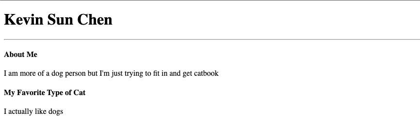
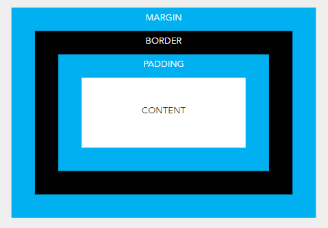
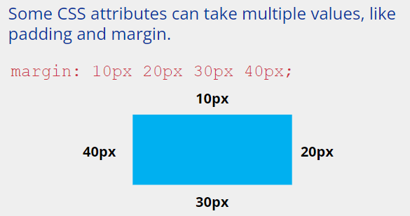
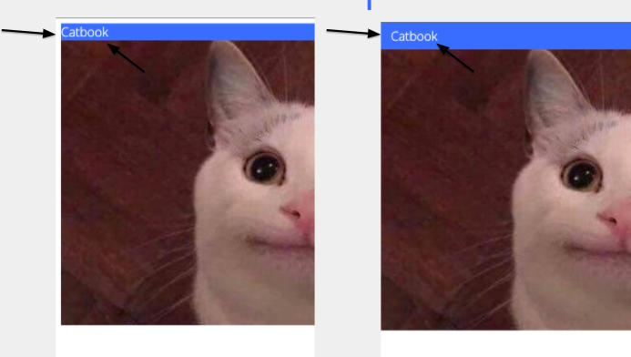
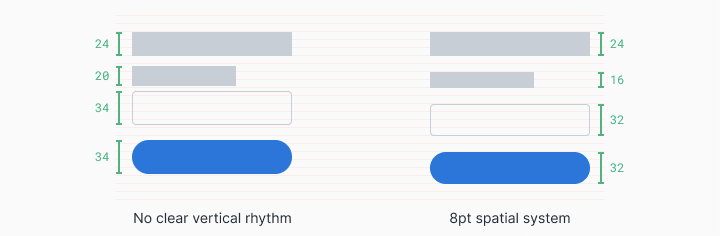

## Webpage files

- **HTML** 

  The structure of websites

  ```HTML
  <div class="text-box">
  <p>So text. Much HTML. Wow.</p>
  </div>
  ```

- **CSS**

  CSS is a way to styling your webpage.

  ```css
  .text-box{
  font-family: "Comic Sans";
  color: pink;
  transform: rotate(20deg);
  }
  ```

- **JS**

  ```js
  var doge = "moar text";
  console.log(doge);
  ```


# HTML & CSS

## HTML

Hypertext Markup Language

HTML = Nested Boxes


**An HTML document**

```html
<!DOCTYPE html>
<html>
    <head>
        <title>Title!</title>
    </head>
    <body>
        <h1>Heading!</h1>
        <p>Paragraph!</p>
    </body>
</html>
```


- `<!DOCTYPE html>`

  All HTML documents must start with a `<!DOCTYPE>` declaration.

  The declaration is not an HTML tag. It is an "information" to the browser about what document type to expect.

  In HTML 5, the declaration is simple: 
  ```html
  <!DOCTYPE html>
  ```

- `<html>`: Opening tag

  `</html>`: Closing tag

- `<head>`: The `<head>` tag in HTML is used to define the head portion of the document which contains information related to the document.
- `<body>`:  The HTML `<body>` tag defines the main content of the HTML document or the section of the HTML document that will be directly visible on your web page.


**Basic HTML Tags**

- `<html>`: Root of HTML Document
- `<head>`: Info about Document
- `<body>`: Document Body
- `<h1>`, `<h2>`, `<h2>`, ...: Header tags
- `<p>`: Paragraph tag
- `<div>`: Generic block section tag
- `<span>`: Generic inline section tag


**HTML Attributes**

```html
<tagname abc="xyz">
	content goes here
</tagname>
```

`abc` <- attribute

`xyz` <- value


**Inserting Links**

The `<a>` tag defines a hyperlink, which is used to link from one page to another.

The most important attribute of the `<a>` element is the `href` attribute, which indicates the link's destination.

```html
<a href="http://weblab.mit.edu">Link to web.lab!</a>
```


**Inserting Images**

```html
</img>
```

A self-closing tag

There is no content, so we simplify it to this.

```html

```

```html

```


**div & span**

The `<div>` tag defines a division or a section in an HTML document.

The `<div>` tag is used as a container for HTML elements - which is then styled with CSS or manipulated with JavaScript.

The `<div>` tag is easily styled by using the class or id attribute.

Any sort of content can be put inside the `<div>` tag! 


The **`<span>`** HTML element is a generic inline container for phrasing content, which does not inherently represent anything. It can be used to group elements for styling purposes (using the class or id attributes), or because they share attribute values.


**The real way to learn Web Dev**

- Google
- Learn
- [MDN](https://developer.mozilla.org/en-US/) is a great resource


## CSS

Cascading Style Sheets

*The rules that tell your web browser how stuff looks*

CSS = A list of descriptions


**CSS ruleset**

```css
div {
    color: red;
    font-family: Arial;
    font-size: 24:pt;
}
```

`div` <- selector

`color` <- property

`red` <- value


**ID and Class**

class form

```html
//hello.html
<h1>Heading!</h1>
<div>Paragraph!</div>
<div class="info">Info</div>
```

```css
//style.css
.info {
    color: red;
    font-family: Arial;
    font-size: 24:pt;
}
```

id form

```html
//hello.html
<h1>Heading!</h1>
<div>Paragraph!</div>
<div id="unique">Info</div>
```

```css
//style.css
#unique {
    color: red;
    font-family: Arial;
    font-size: 24:pt;
}
```

difference

| ID                                   | Class                                       |
| ------------------------------------ | ------------------------------------------- |
| An element can have only one ID      | An element can have multiple classes        |
| IDs must be unique in any given HTML | Can use the same class on multiple elements |
| #id { }                              | .classname{ }                               |

**Only use classes for CSS styling!**


**Combining HTML and CSS**

How would we connect a html files to a CSS file?

```html
<!DOCTYPE html>
<html>
    <head>
        <title>Title!</title>
        <link rel="stylesheet"
              href="style.css" />
    </head>
    <body>
        <h1>Heading!</h1>
        <p>Paragraph!</p>
    </body>
</html>
```

 

## Catbook

### Exercise 1: Kitten Started

Let’s try adding some text about us in index.html!Recall the `<html>`, `<h1>`, `<p>` and` <div> `tags. Perhaps some others such as [<section>](https://developer.mozilla.org/en-US/docs/Web/HTML/Element/section) might be useful... 🤔



```html
<!DOCTYPE html>
<html>
  <head>
    <title>Catbook</title>
  </head>

  <body>
    <h1>Kevin Sun Chen</h1>
    <hr />
    <section>
      <h4>About Me</h4>
      <p>I am more of a dog person but I'm just trying to fit in and get catbook</p>
    </section>
    <section>
      <h4>My Favorite Type of Cat</h4>
      <p>I actually like dog</p>
    </section>
  </body>
</html>
```

### Exercise 2: Pretty Paws

Let’s add a profile picture index.html!Hint! Recall the `` tag and its attribute?

```html

<h1>Kevin Sun Chen</h1>
<hr />
```

Making it Stylish

```html
<link rel="stylesheet" href="style.css" />

<h1 class="u-textCenter">Kevin Sun Chen</h1>
```

```css
.u-textCenter {
  text-align: center;
}
```

### Exercise 3: Centerpiece

**Use u-textCenter to center other text!**

```html
<body>
  
  <h1 class="u-textCenter">Kevin Sun Chen</h1>
  <hr />
  <section class="u-textCenter">
    <h4>About Me</h4>
    <p>
      I am more of a dog person but I'm just trying to fit in and get catbook
    </p>
  </section>
  <section class="u-textCenter">
    <h4>My Favorite Type of Cat</h4>
    <p>
      I actually like dogs
    </p>
  </section>
</body>
```

**Import Fonts**

[fonts.google.com](fonts.google.com)

```css
/* Your Code Here! */
@import url('https://fonts.googleapis.com/css2?family=Open+Sans:wght@300;500&display=swap');

.u-textCenter {
  text-align: center;
}

body {
  font-family: 'Open Sans', sans-serif;
}
```

**Adding a Navbar**

add the tag <nav> at the top for our navbar content.

```html
<nav class="navContainer">
	<h1 class="navTitle">Catbook</h1>
</nav>
```


**Color the Navbar**

**CSS Variables**

CSS has **CSS variables** that can be defined and then used throughout. We'll define our colors as variables.

```css
:root {
  --primary: #396dff;
  --grey: #f7f7f7;
  --white: #fff;
}

.navTitle {
  color: var(--primary);
  font-size: 20px;
  /* Below cancels out some of the default styling of h1 */
  margin: 0; 
  font-weight: normal;
}
```


### Exercise 4: Cat's Head

Now try using those variables to style the nav bar!

```css
.navContainer {
  background-color: var(--primary)
}
```

```html
<nav class="navContainer">
	<h1 class="navTitle">Catbook</h1>
</nav>
```


**The void**

**Box Model**



**Margin**



**Padding**



**8pt Grid System**



```css
:root {
  --primary: #396dff;
  --grey: #f7f7f7;
  --white: #fff;

  --xs: 4px;
  --s: 8px;
  --m: 16px;
  --l: 24px;  
}

.navContainer {
  padding: var(--s) var(--m);
  background-color: var(--primary);
}
```

### Exercise 5: Feline Good

Using the variables we defined for the 8pt system, try rounding the corners of your profile picture.

```html

```

```css
img.avatar {
  max-width: 100%;
  border-radius: var(--m);
}
```

### Exercise 6: Stay Pawsitive

But can you make it perfectly round?

```html
<div class="avatarContainer">
	<div class="avatar"></div>
</div>
```

```css
.avatarContainer {
  padding: 0 35%;
}

.avatar {
  /* make it responsive */
  max-width: 100%;
  width: 100%;
  height: auto;
  display: block;
  /* div height to be the same as width*/
  padding-top: 100%;

  /* make it a circle */
  border-radius: 50%;

  /* Add image */
  background-image: url("cat.jpeg");

  /* Centering on image`s center*/
  background-position-y: center;
  background-position-x: center;
  background-repeat: no-repeat;

  /* it makes the clue thing, takes smaller dimension to fill div */
  background-size: cover;

  /* it is optional, for making this div centered in parent*/
  margin: 0 auto;
}
```

**Flex**

Flexbox is a flexible box that lets you control the direction, sizing distribution, and more of items.

```html
<div class="u-flex">
    
</div>
```

```css
.u-flex {
  display: flex;
}
```


### Exercise 7: A little Fur-ther

Using [this](https://css-tricks.com/snippets/css/a-guide-to-flexbox/) overview , try and make the columns the same size.

```css
.subContainer {
  flex-grow: 1;
  flex-basis: 0;
}
```

We recommend the guide linked in: https://css-tricks.com/snippets/css/a-guide-to-flexbox

And these games:

https://flexboxfroggy.com/ - good for learning 🐸

http://www.flexboxdefense.com/ - good for 💪🏼

