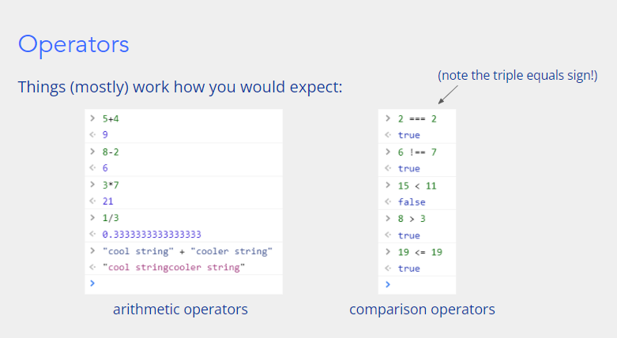
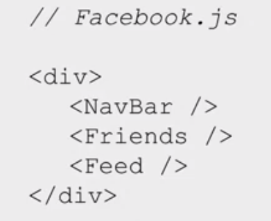
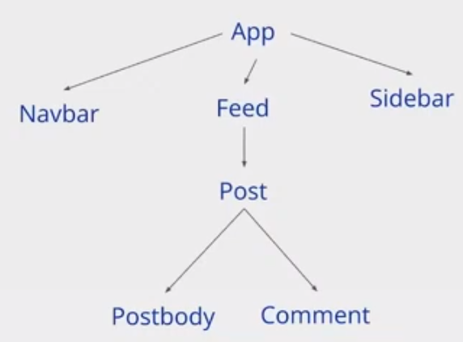
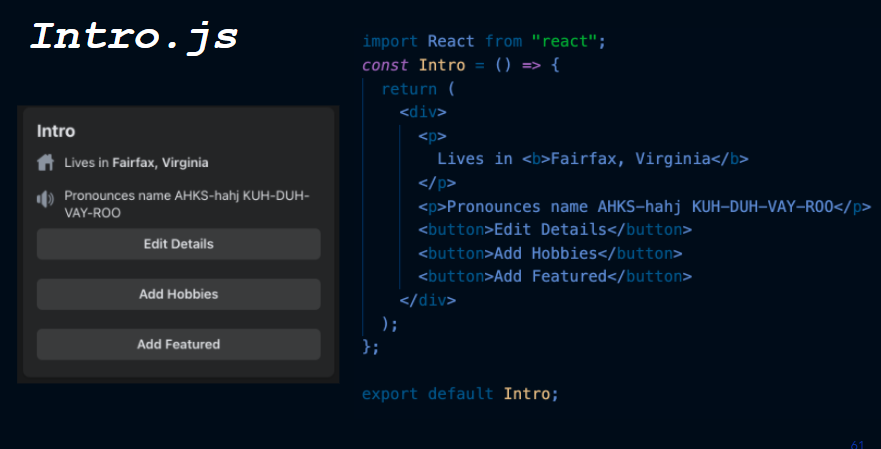
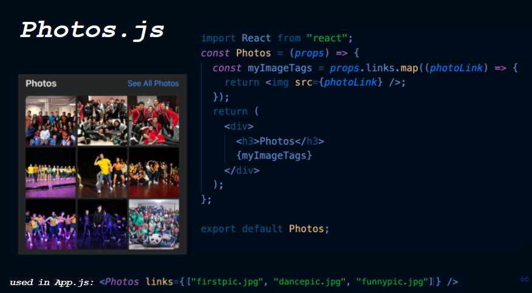
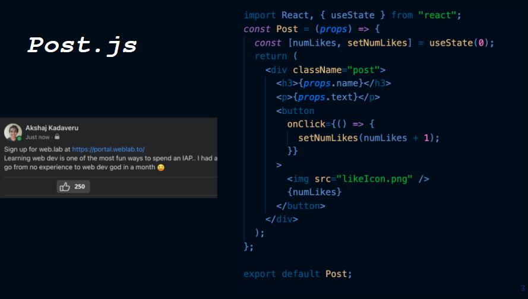

# JavaScript

JavaScript is a programming language that manipulates the content of a web page.

Make your website interactive.

**Where does it go?**

Where can we run JavaScript code?

1. The browser console

   > Chrome: Ctrl + Shift + J (on Windows) /  cmd + Option + J (on Mac)

2. Tied to our HTML file

**Types**

JavaScript has 5 primitive data types:

- Boolean (true, false)
- Number (12, 1.618, 0)
- String ("hello", "world")
- Null 
- Undefined

**Operators**




**Syntax**

- Every statement in JavaScript ends with a semicolon;
- Whitespace is ignored (but can improve readability)
- Curly braces denote where blocks begin and end.
- // comments

**Defining variables**

```javascript
let myBoolern = true;
let myNumber = 12;
let myString = "Hello World!";

myBoolean = false;
myNumber = -5.6;
myString = "";
```

JavaScript convention is to name variables using **camelCase**


**Defining constants**

To define a variable which cannot be re-assigned later:

```javascript
const answerToLife = 6.148;
```


**null vs. undefined**

undefined means "declared but not yet assigned a value"

null means "no value"

```javascript
let firstName;
// currently, firstName is undefined

firstName = "Albert";
// firstName has now been assigned to a value.

firstName = null;
// we can explicitly "empty" the variable
```


**let vs. var**

`let` is block-scoped

`var` is function-scoped

Don't use var!


**Output**

```javascript
console.log("Hello");
```

Handy for quick debugging!


**Alerts**

`alert()` generates a pop-up notification with the given content.


**Arrays**

```javascript
// initialize
let pets = ["cat", "dog", "guinea pig", "bird"];

// access
console.log(pets[3]);

// replace
pets[2] = "hamster";

pets.pop();
pets.push("bird");
```


**Conditionals**

```Javascript
if (hour < 12) {
    console.log("Good morning!");
} else if (hour < 16) {
    console.log("Good afternoon!");
} else {
    console.log("Good night!");
}
```


**While loops**

```javascript
let z = 1;

while (z < 1000) {
    z = z * 2;
    console.log(z);
}
```


**For loops**

```javascript
let pets = ["cat", "dog", "guinea pig", "bird"];

for (let i = 0; i < pets.length; i++) {
    const phrase = "I love my " + pets[i];
   	console.log(phrase);
}
```


**For ... of ...**

```javascript
let pets = ["cat", "dog", "guinea pig", "bird"];

for (const animal of pets) {
    const phrase = "I love my " + animal;
   	console.log(phrase);
}
```

 

**Functions**

Syntax: (parameters) => { body };

```javascript
// parentheses are optional if there's only only one parameter
const celsiusToFahrenheit = tempC => {
    const tempF = tempC * 1.8 + 32;
    return tempF;
}
```


**Callback functions**

```javascript
const addTwo = x => {
    return x + 2;
}

const modifyArray = (array, callback) => {
   for (let i = 0; i < array.length; i++) {
       array[i] = callback(array[i]);
   }
}

let myArray = [5, 10, 15, 20];
modifyArray(myArray, addTwo);
```

**Anonymous functions**

```javas
const modifyArray = (array, callback) => {
   for (let i = 0; i < array.length; i++) {
       array[i] = callback(array[i]);
   }
}

let myArray = [5, 10, 15, 20];
modifyArray(myArray, x => {
	return x + 2;
});
```


if your function is simple enough, you can use the following shorthand. 

Syntax: (parameters) => output;

```javascript
modify(Array, x => x + 2)
```


**Other build-in array functions**

We also have `map` and `filter`, which produce a new array based on some instruction.

```javascript
let myArray = [1, 2, 3, 4, 5];
let modifiedArray = myArray.map(x => x * 3);
```

```javascript
const validNames = staffNames.filter(name => name != "");
```


**Objects**

A JavaScript is a collection of name: value pairs;

```javascript
const myCar = {
    make 	: "Ford", 
    model	: "Mustang",
    year	: 2005,
    color	: "red"
}

console.log(myCar.model);
console.log(myCar["color"])
```


**Object destructuring**

**Object destructuring** is a shorthand to obtain multiple properties at once.

```javascript
const { make, model } = myCar;
```


**Equality**

What does === mean for arrays and objects?

```javascript
let person1 = {name: "Bill"};
let person2 = {name: "Bill"};

person1 === person2; // false
```

Object references

Object variables are references - they point to where the data is actually stored.


**How to copy arrays and objects**

One way to copy arrays and objects is to use the **spread** operator (...) like so:

```javascript
let arr = [1, 2, 3];
let copyArr = [...arr];

let obj = { name: "Bill Gates" };
let copyObj = { ...obj };
```


**Why we don't  use ==**

```javascript
2 == 2;		// true
2 == "2";	// also true!
```

It performs type coercion (i.e. forces the arguments to be of the same type before comparing them)


**Classes**

If you want multiple entities that are guaranteed to have shared behavior, use classes!

```javascript
class Rectangle {
    constructor(width, height) {
        this.width = width;
        this.height = height;
    }
    
    getArea = () => {
        return this.width * this.height;
    }
}

const smallRect = new Rectangle(3, 4);
const bigRect = new Rectangle(15, 14);
console.log(smallRect.width);
console.log(bigRect.height);

console.log(smallRect.getArea());
```


# JavaScript Workshop

## Step 1: Modify the update speed

```javascript
const SNAKE_SPEED = 5;
const main = () => {
    update();
    draw();
}

setInterval(main, 1000/SNAKE_SPEED);

const update = () => {
    console.log("Updating");
}

const draw = () => {
}
```

## Step 2: Create a snake and make it move simply

```javascript
const SNAKE_SPEED = 5;

const snakeBody = [
    {x:11, y:11},
    {x:11, y:10},
    {x:11, y:9}
];

const updateSnake = () => {
    // remove tail segment
    snakeBody.pop();

    // add a new head segment
    const newHead = { ...snakeBody[0] };
    newHead.x += 0;
    newHead.y += 1;
    
    snakeBody.unshift(newHead);
};

// Don't change this function!
const drawSnake = (gameBoard) => {
    for (let i = 0; i < snakeBody.length; i++) {
        const segment = snakeBody[i];
        const snakeElement = document.createElement("div");
        snakeElement.style.gridRowStart = segment.y;
        snakeElement.style.gridColumnStart = segment.x;
        snakeElement.classList.add("snake");
        gameBoard.appendChild(snakeElement);
    }
}
```


## Step 3: Allow Key Input

```javascript
window.addEventListener('keydown', event => {
  if (event.key === "ArrowUp") {
    inputDirection = {x:0, y:-1};
  } else if (event.key == "ArrowDown") {
    inputDirection = {x:0, y:1};
  } else if (event.key == "ArrowLeft") {
    inputDirection = {x:-1, y:0};
  } else if (event.key == "ArrowRight") {
    inputDirection = {x:1, y:0};
  }
});

const getInputDirection = () => {
  return inputDirection;
}
```

Fix 180-turn bug 

```javascript
let inputDirection = {x:0, y:1};

window.addEventListener('keydown', event => {
  if (event.key === "ArrowUp" && inputDirection.y === 0) {
    inputDirection = {x:0, y:-1};
  } else if (event.key == "ArrowDown" && inputDirection.y === 0) {
    inputDirection = {x:0, y:1};
  } else if (event.key == "ArrowLeft" && inputDirection.x === 0) {
    inputDirection = {x:-1, y:0};
  } else if (event.key == "ArrowRight" && inputDirection.x == 0) {
    inputDirection = {x:1, y:0};
  }
});

const getInputDirection = () => {
  return inputDirection;
}
```


## Step4: Add Food

```javascript
const updateFood = () => {
    if (onSnake(food)) {
        growSnake();
        food = getNewFoodPosition();
    }
}
```

```javascript
const GRID_SIZE = 21;

const onSnake = (position) => {
    for (let i = 0; i < snakeBody.length; i++) {
        if (equalPositions(position, snakeBody[i])) {
            return true;
        }
    }
    return false;
}

const equalPositions = (pos1, pos2) => {
    return pos1.x === pos2.x && pos1.y === pos2.y;
}

const growSnake = () => {
    snakeBody.push({ ...snakeBody[snakeBody.length - 1] });
}

const getNewFoodPosition = () => {
    let randomFoodPosition = randomGridPosition();
    while (onSnake(randomFoodPosition)) {
        randomFoodPosition = randomGridPosition();
    }
    return randomFoodPosition;
} 

const randomGridPosition = () => {
    return {
        x: Math.floor(Math.random() * GRID_SIZE) + 1,
        y: Math.floor(Math.random() * GRID_SIZE) + 1
    };
}
```


## Step5: Game Over 

```javascript
const gameBoard = document.getElementById("game-board");
let gameOver = false;

const main = () => {
    update();
    draw();
    if (gameOver) {
        alert("Game Over");
        clearInterval(gameLoop);
    }
}

let gameLoop = setInterval(main, 1000/SNAKE_SPEED);

const update = () => {
    console.log("Updating");
    updateSnake();
    updateFood();
    gameOver = isGameOver();
}

const draw = () => {
    gameBoard.innerHTML = "";
    drawSnake(gameBoard);
    drawFood(gameBoard);
}

const isGameOver = () => {
    return snakeOutOfBounds() || snakeIntersectSelf();
}
```

```javascript
const outOfBounds = (position) => {
    return position.x < 1 || position.x > GRID_SIZE || position.y < 1 || position.y > GRID_SIZE;
}

const snakeOutOfBounds = () => {
    return outOfBounds(snakeBody[0]);
}

const snakeIntersectSelf = () => {
    for (let i = 1; i < snakeBody.length; i++) {
        if (equalPositions(snakeBody[0], snakeBody[i])) {
            return true;
        }
    }
    return false;
}
```


# Intro to ReactJS

React - A JavaScript library for building user interfaces



This 'fake HTML tags' are called Components.


**React Apps are "components of components"**

The App component (`<App />`)

```react
<Bavbar />
<Sidebar />
<Feed /> 
```

**Component Tree Structure**



**Summary**

- React is a Framework that lets you **divide up your website into react components**
- Each component is kind of like a 'custom HTML tag' that you define.
- Your app can be divided into a 'tree' of components


**Comment Component**

`Props` ('inputs')

Inputs passed from a parent to a child component


Now we have our reusable comment component

- We pass props in from parent to child 
- Allows our skeleton to render comments with content

`State` - (Private information maintained by a component)

- State keeps track of private information that can be changed and influence how your app renders.


### Writing ReactJS Components

```javascript
import React, { useState } from "react"

const Comment = (props) => {
    const [isLiked, setIsLIked] = useState(false);
    
    // return the content of the comment
    // () allows us to write HTML content inside JavaScript
    // {} allows us to return to JavaScrit inside the HTML environment inside the JavaScript class
    return (
        // Note: we use className to access CSS classes
        <div id="claireComment" className="comment-text">
        	{props.content}
        </div>
        // Expects a return type of HTML
        // What you return will describe how the component appears.
    )
}
```

​    

**APP.js**








### Recap: Writing Functional Components

- We divide our app into components, and put one in each file

- Each component is a function with props as the input, and returns HTML-like code 

- () allows us to enter an HTML environment

- inside the HTML environment, {} allow us to create a mini JS environment

- We pass in props with 

  ```javascript
  <Prost text = "I love weblab" />
  ```

- We read in those props with props.text

- we declare state variables with 

  ```javascript
  const [something, setSomething] = React.useState(initialValue)
  ```

- React use `className` instead of `class` for css styles.

