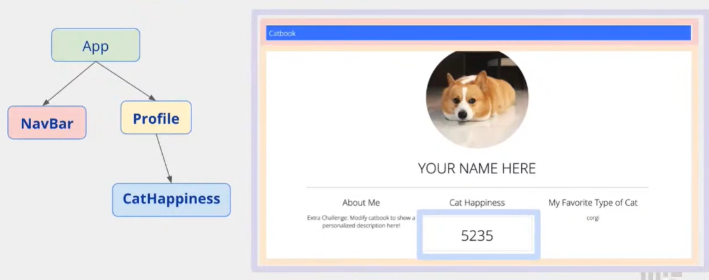
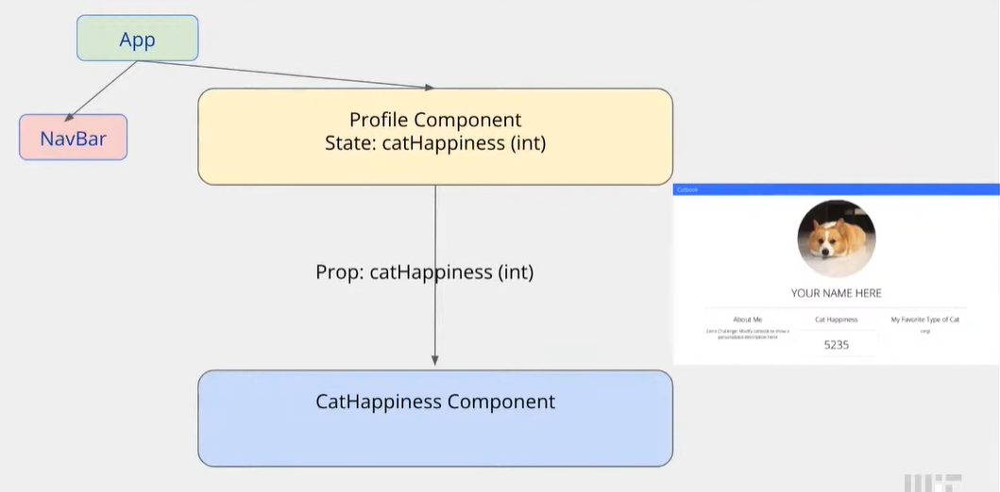

## Workshop 2: Catbook in React

### First: The component tree for Catbook!



```bash
npm run hotloader
```

Navigate to **localhost:5000** and see the page update with your live changes!


### Exercise 1: Implementing React Navbar

```js
const NavBar = () => {
  return (
    // TODO Step 0: Implement NavBar similar to old navigation bar found in old_index.html.
    // Hint: Look for the <nav> HTML tag.
    // Remember "class" attributes in HTML are renamed to "className" in ReactJS.
    <nav className="navContainer">
      <div className="navTitle">Catbook</div>
    </nav>
  );
};
```

### Exercise 2: Adding cat Happiness

Why Profile? 

We want to update 'catHappiness' when the cat is clicked.



### Exercise 3: Add the CatHappiness Component

```js
import CatHappiness from "../modules/CatHappiness.js"

const [catHappiness, setCatHappiness] = useState(888);

<div className="Profile-subContainer u-textCenter">
	<h4 className="Profile-subTitle">Cat Happiness</h4>
	<CatHappiness num={catHappiness} />
</div>
```

```js
<div className="Profile-subContainer u-textCenter">
	<h4 className="Profile-subTitle">Cat Happiness</h4>
	<CatHappiness num={catHappiness} />
</div>
```

### Exercise 4: Update CatHapiness State

```js
const incrementCatHappiness = () => {
	// TODO Step 2: Implement function to update and maintain state of cat happiness when user clicks on picture
    setCatHappiness(catHappiness + 1);
};


<div className="Profile-avatarContainer" onClick={incrementCatHappiness}>

```


## APIs & Async

**HTTP Methods**

- GET gets data
- POST creates data
- PUT modifies data
- DELETE deletes data

**Status Codes**

- 1**- informational
- 2**- you succeeded
- 3**- redirect
- 4**- you did something wrong
- 5**- server did something wrong

**APIs**

- Application Program Interface
- Simply a set of endpoints a service allows you to make requests to 
- Companies such as Google, Amazon, and Facebook all provide APIs to allow others to implement their services 

**Endpoints**

- By accessing a URL, you are making a request to an endpoint
- .../api/stories, a GET request for all stories
- .../api/story, a POST request to make a story
- Multiple end points can under the same URLs, but are differentiated based on the type of request
- ../comment, gets or adds a comment based on GET or POST

