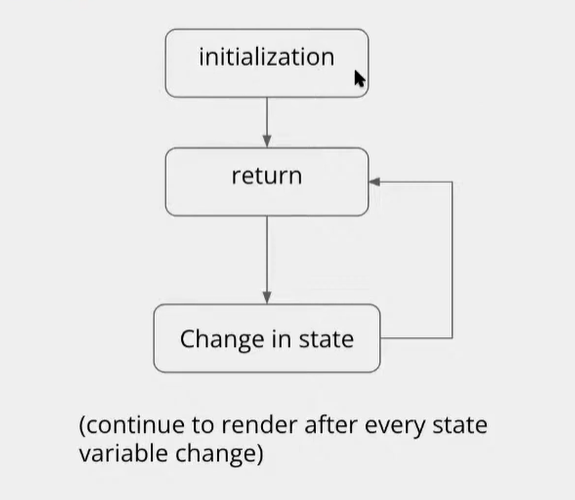
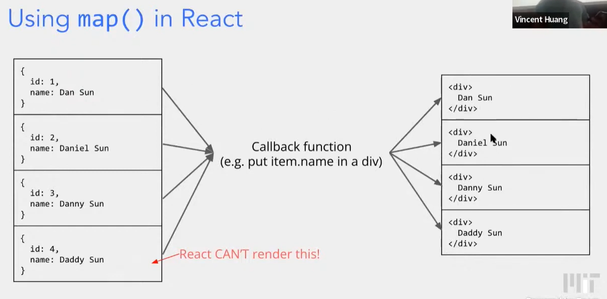

## Workshop 2: Catbook in React

### First: The component tree for Catbook!


```bash
npm run hotloader
```

Navigate to **localhost:5000** and see the page update with your live changes!


### Exercise 1: Implementing React Navbar

```js
const NavBar = () => {
  return (
    // TODO Step 0: Implement NavBar similar to old navigation bar found in old_index.html.
    // Hint: Look for the <nav> HTML tag.
    // Remember "class" attributes in HTML are renamed to "className" in ReactJS.
    <nav className="navContainer">
      <div className="navTitle">Catbook</div>
    </nav>
  );
};
```

### Exercise 2: Adding cat Happiness

Why Profile? 

We want to update 'catHappiness' when the cat is clicked.


### Exercise 3: Add the CatHappiness Component

```js
import CatHappiness from "../modules/CatHappiness.js"

const [catHappiness, setCatHappiness] = useState(888);

<div className="Profile-subContainer u-textCenter">
	<h4 className="Profile-subTitle">Cat Happiness</h4>
	<CatHappiness num={catHappiness} />
</div>
```

```js
<div className="Profile-subContainer u-textCenter">
	<h4 className="Profile-subTitle">Cat Happiness</h4>
	<CatHappiness num={catHappiness} />
</div>
```

### Exercise 4: Update CatHapiness State

```js
const incrementCatHappiness = () => {
	// TODO Step 2: Implement function to update and maintain state of cat happiness when user clicks on picture
    setCatHappiness(catHappiness + 1);
};


<div className="Profile-avatarContainer" onClick={incrementCatHappiness}>

```


## APIs & Async

**HTTP Methods**

- GET gets data
- POST creates data
- PUT modifies data
- DELETE deletes data

**Status Codes**

- 1**- informational
- 2**- you succeeded
- 3**- redirect
- 4**- you did something wrong
- 5**- server did something wrong

**APIs**

- Application Program Interface
- Simply a set of endpoints a service allows you to make requests to 
- Companies such as Google, Amazon, and Facebook all provide APIs to allow others to implement their services 

**Endpoints**

- By accessing a URL, you are making a request to an endpoint
- .../api/stories, a GET request for all stories
- .../api/story, a POST request to make a story
- Multiple end points can under the same URLs, but are differentiated based on the type of request
- ../comment, gets or adds a comment based on GET or POST

## React Continued

Note: You can't directly edit a component's state from another component!

### A Workaround: Callback Functions

passing setState function to child and then calling it from there

```js
// ParentComponet
const changeCatHappiness = () => {
    setCatHappiness(catHappiness + 1);
}

return (
	<ChildComponent updateFunction=}{changeCatHappiness} />
)
```

workaround


### In-depth: Utilizing state

Scenario: Modifying original state

```react
buyDog = () => {
    setPets(pets.concat["dog"]);
}
```

Scenario: Alternative way to update state with object destructuring (generally recommended)

```js
buyDog = () => {
    setPets([...pets, "dog"]);
}
```


**What is this function going to print?**

```react
testingStuff = () => {
    /* assume persons starts as an empty array [] */
    setPersons([...persons, "me"]);
    console.log(persons);
}
```

The set person's function is asynchronous.

 

### Lifecycle Timeline




**`useEffect()`  hook**

- Runs after specific variables change
  - Can think of as response to state change 
  - Commonly used to load data into state
  - Call an API/perform some computation/etc. at specific times
- syntax: useEffect(function, optional dependency array)
  - runs function every time a variable in dependency array changes

```react
useEffect(() => {
    console.log(persons);
}, [persons])

// whenever persons is changed, the function will be called
```


- useEffect(function, [var1, var2]) runs function every time var1 or var2 changes
- useEffect(function, []) runs function once, immediately after initialization
- useEffect(function) runs every time any state variable changes


### get() and post()

```react
get("/api/foo", { bar: 0}).then((res))
```

```react
useEffect(() => {
    get("/api/packets").then((packageList) => {
        setPacket(packageList);
    })
}, [])
```


### Sending data

```react
const handleToggleAdmin = () => {
    post("/api/user/admin", {admin: !admin}.then(() => {
        setAdmin(!admin);
    })
}
```


### Review: JSX

Just a way to write HTML onto the page, but from JavaSript!

```jsx
const element = <h1> Floow me at http://twitter.com</h1>;
```

```jsx
let header = <h1>I love kevin qian</h1>;
let content = <p>uwu</p>;

return (
	<div>
    	{header}
        {content}
    </div>
)
```


### Using map() in React



```react
return date.map((item) => {
    return <div key = {item.id}>{item.text}</div>
})
```


**Math**

- Math.abs()
- Math.min(), Math.max()
- Math.PI, Math.sin()
- etc.


**Dates**

```js
let bDay = new Date(1912, 10, 20);
let nextDay = new Date(bday);
let nextDay.setDate(nextDay.getDate() + 1);
```


**Sets**

 ```js
 let s = new Set()
 let s.add(1)
 let s.add(2)
 let s.add(1) // s = {1, 2}
 ```


**JSON**

convert objects into strings and vice verse

```js
let x = {1: 2, foo: {uwu: 'owo'}}
let y = JSON.stringify(x)
let z = JSON.parse(y)
```


**Other React info**

https://reactjs.org/docs/hooks-reference.html


## Workshop 3: Data Fetching and Routing Workshop

**Warmup**

- In App,js
  - Import Feed.js
  - Render Feed instead of Profile

---

```react
const Feed = () => {
  // TODO (step1): define state to hold stories
  const [stories, setStories] = useState([]);

  useEffect(() => {
    // TODO (step1): implement a GET call to retrieve stories,
    // and assign it to state
    get("/api/stories").then(
      (storyObjs) => {
        setStories(storyObjs);
      }
    );
  }, []);

  return <div> { JSON.stringify(stories) } </div>;
  // TODO (step1): render the raw stories data from state
  // TODO (step2): render a SingleStory with hardcoded props
  // TODO (step3): map the state to SingleStory components
  // TODO (step4): add in the NewStory component
  // TODO (step6): use Card instead of SingleStory
};
```

---

```react
const SingleStory = (props) => {
  return (
    <div className="Card-story">
      <div> {props.creator_name} </div>
      <div> {props.content} </div>
      {/* TODO (step2): use JSX and props to render story creator and content */}
    </div>
  );
};
```

```js
const Feed = () => {
  // TODO (step1): define state to hold stories
  const [stories, setStories] = useState([]);

  useEffect(() => {
    get("/api/stories").then((storyObjs) => {
      setStories(storyObjs);
    });
  }, []);

  let feedStories = null;
  if (stories.length !== 0) {
    feedStories = stories.map((storyObj) => {
      return <SingleStory creator_name={storyObj.creator_name} content={storyObj.content}/>;
    });
  } else {
    feedStories = <div> no stories :(( </div>
  }


  return (
    <div>
      {feedStories}
    </div>
  );
  // TODO (step3): map the state to SingleStory components
  // TODO (step4): add in the NewStory component
  // TODO (step6): use Card instead of SingleStory
};
```

```react
const NewPostInput = (props) => {
  const [value, setValue] = useState("");

  // called whenever the user types in the new post input box
  const handleChange = (event) => {
    setValue(event.target.value);
  };

  // called when the user hits "Submit" for a new post
  const handleSubmit = (event) => {
    event.preventDefault();
    props.onSubmit && props.onSubmit(value);
    setValue("");
  };

  return (
    <div className="u-flex">
      <input
        type="text"
        placeholder={props.defaultText}
        value={value}
        onChange={handleChange}
        className="NewPostInput-input"
      />
      <button
        type="submit"
        className="NewPostInput-button u-pointer"
        value="Submit"
        onClick={handleSubmit}
      >
        Submit
      </button>
    </div>
  );
};

/**
 * New Story is a New Post component for stories
 */
const NewStory = () => {
  // TODO (step4): implement addStory
  const addStory = (value) => {
    post("/api/stories", {content: value});
  };
  // TODO (step4): implement render
  return <NewPostInput onSubmit={addStory} defaultText="enter post here" />
};
```

