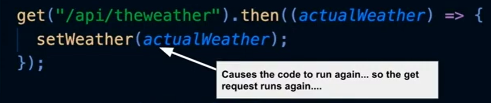
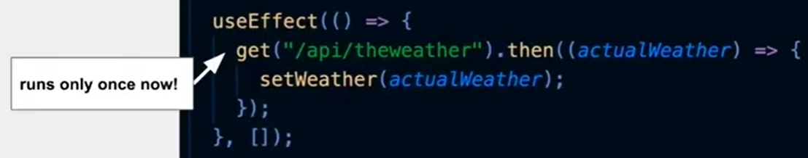

## Catbook 4: Data Fetching and Routing Workshop

### App navigation

URL (address bar) -> Router (component)

```react
const App = () => {
  return (
    // <> is like a <div>, but won't show
    // up in the DOM tree
    <>
      <NavBar />
      <div className="App-container">
      <Router>
        <Profile path="/profile" />
        <Feed path="/" />
        <NotFound default />
      </Router>
        {/* TODO (step5): use Router to route between pages */}
      </div>
    </>
  );
};
```

```react
const NavBar = () => {
  return (
    <nav className="NavBar-container">
      <div className="NavBar-title u-inlineBlock">Catbook</div>
      <div className="Nav-linkContainer u-inlineBlock">
        <Link className="NavBar-link" to="/">Home</Link>
        <Link className="NavBar-link" to="/profile">Profile</Link>
      </div>
      {/* TODO (step5): implement links to pages */}
    </nav>
  );
};
```

### Comment

Reminder of high level overview:

- Get to obtain stories
- SingleComment component renders data

```react
const Card = (props) => {
  // TODO (step6): define state to hold comments (refer to Feed)
  const [comments, setComments] = useState([]);

  useEffect(() => {
    get("/api/comment", {parent: props._id}).then((commentObjs) => {
      setComments(commentObjs);
    });
    // TODO (step6): implement a GET call to retrieve comments,
    // and assign it to state
  }, []);

  return (
    <div>
      <SingleStory _id={props._id} creator_name={props.creator_name} content={props.content} />
      {JSON.stringify(comments)}
    </div>
  )

  // TODO (step6): render a SingleStory using props,
  // and render the comments from state (with JSON.stringify)
  // TODO (step7): map comments from state into SingleComment
  // components (refer to Feed)
  // TODO (step8): add in the NewComment component (refer to Feed)
  // TODO (step9): use CommentsBlock
};
```

### Step 7

Implement SingleComment.js

```react
const Card = (props) => {
  const [comments, setComments] = useState([]);

  useEffect(() => {
    get("/api/comment", { parent: props._id }).then((commentItems) => {
      setComments(commentItems);
    });
  }, []);

  let commentsList = null;
  const hasComment = comments.length !== 0;
  if (hasComment) {
    commentsList = comments.map((commentObj) => (
      <SingleComment _id = {commentObj._id} creator_name={commentObj.creator_name} content={commentObj.content} /> 
    ));
  } else {
    commentsList = <div>No comment!</div>;
  }

  return (
    <div className="Card-container">
        <SingleStory
          _id={props._id}
          creator_name={props.creator_name}
          content={props.content}
        />
        {commentsList}
    </div>
  );
  // TODO (step7): map comments from state into SingleComment
  // components (refer to Feed)
  // TODO (step8): add in the NewComment component (refer to Feed)
  // TODO (step9): use CommentsBlock
};
```

### Step 8

Implement NewComment in NewPostInput.js

```react
const NewComment = () => {
  const addComment = (value) => {
    // TODO (step8): implement addComment (refer to NewStory)
    const body = { parent: props.storyId, content: value };
    post("/api/comment", body);
  };
  return <NewPostInput defaultText="New Comment" onSubmit={addComment} />;
  // TODO (step8): implement render (refer to NewStory)
};
```

### Step 9

```react
const CommentsBlock = () => {
  // TODO (step9): implement render
  return (
    <div className="Card-commentSection"> 
      {props.comments.map((commentObj) => (
        <SingleComment
          _id={commentObj._id}
          creator_name={commentObj.creator_name}
          content={commentObj.content}
        />
      ))}
      <NewComment storyId={props._id} />
    </div>
  );
};
```

## Review and Wireframe

Note:

Components re-run their code whenever state or props changes



if we code like so, it will enter a infinite loop. Because whenever it gets weather, the state will be changed, an it will get again.

so we use 'useEffect()'



the code will run only once.


### Design and Wireframing

UI: User Interaction

- Strategy
- User Research
- Accessible 
- Usability

UX: User experience

- Colors 
- Visual Design
- Animation
- Aesthetic

Good UX: Users don't need to be told how wo use your app


## Set up your own Server

Using your own machine as a server 

- Every computer  can run server code
- Your own computer has a special domain: localhost

**What is a server written in** 

What do we teach in this case

We use **express.js**, but we also need to use a tool to run javascript code

Node **runs** Javascript on your machine

Express allows you to structure your javascript

Node Package Manager (npm)


**Importing External Code**

Every Javascript project has some necessary information 

package.json holds project metadata.  -> `npm install` 


**Understanding our codebase**

/client

- Contains all our React code, components, pages, utilities, etc. (Front end)

/server

- Contain all of our backend code

Other files 

- Set up by staff to configure React app. 

 

**Creating our first API endpoint**

```js
const app = express();

app.get("/api/test", (req, res) => {
	res.send({ message: "Wow I made my first API!"});    
})
```

**Adding Error Handling**

```js
app.use((err, req, res, next) => {
    if( status === 500 ）{
    	// 500 means Internal Server Error
       console.log("The server errored when processing a request");
    	console.log(err);
    }       
        
    res.status(status);
	res.send({
        status: status,
        message: err.message,
    })
});
```

**Introducing a "Catch All" Endpoint**

All endpoints which are not concretely defined will hit the * endpoint.

We want to return the HTML and bundle files of our React app.

```js
const reactPath = path.resolve(__dirname, "..", "client", "dist");
app.use(express.static(reactPath));

app.get('*', (req, res) => {
  res.sendFile(path.join(reactPath, "index.html"));
});
```


**localhost:3000 or localhost:5000**

- Both are servers running on our machine!
  - localhost:5000 -> hotloader, processes react code
  - localhost:3000 -> node server, our backend server
- To view your website -> use localhost:5000
- To test your backend -> use localhost:3000


**Last step: Adding Middleware**

Express allows you to add middleware.

- Run code in between receiving a request and running endpoint code.
- Register middleware by calling app.use(...)
- Express JSON Parser Middleware will be needed for the next workshop


## API workshop

API endpoint - a part of the server that performs some specific function

API route - the name you use to access that endpoint

These are equivalent for our purposes (there is a 1:1 mapping)

### Use api Route for Requests

#### Part 1: Create the router

open api.fs from ./server directory

```js
const router = express.Router();
```

#### Part 2: Connect api.js to our main server

```js
const express = require("express")
const router = express.Router();
module.exports = router;
```

```js
// server.js

// import the router from out API file
const api = require("./api.js");

//connect API router from api.js
app.use("/api", api);
```

#### Part 3: Move our route into api.js

```js
// api.js
router.get("/test", (req, res) => {
    res.send({ message: "Hello" });
})
```


### Catbook Route

How to store our data?

For now, just declare an object called data

Stories are in data.stories

Comments are in data.comments

```js
const MY_NAME = "Hackerman";

const data = {
  stories: [
    {
      _id: 0, 
      creator_name: "Shannen Wu",
      conntent: "I love corgis!"
    }
  ], 
  comments: [
    {
      _id: 0, 
      creator_name = "Jessica Tang", 
      parent: 0,
      content: "Wow! Me Too!",
    }
  ],
};
```

**req and res**

req is the incoming request

- req.query

- req.body

res is your server's response

- res.send(`<object>`)
- res.status(`<status code>`)

#### Part 1: GET /api/stories

What does this route need to do?

​	Send back all the stories to the frontend

How can we access all the stories>

​	data.stories

```js
router.get("/stories", (req, res) => {
    res.send(data.stories);
});
```

#### Part 2: GET /api/comments

```js
router.get("/comment", (req, res) => {
  res.send(data.comments.filter( (CommentObj) => {
    return CommentObj.parent == req.query.parent;
  }));
});
```


---


#### Part 1: Handling missing API routes

```js
router.all("*", (req, res) => {
  console.log("API route not found: ${req.method} ${req.url}");
  res.status(404).send({ msg: "API route not found" });
})
```


### The POST body

From NewPostInput.js;

```js
const addComment = (value) => {
    const body = { parent: props.storyId, content: value };
    post("/api/comment", body).then((comment) => {
        props.addNewComment(comment);
    });
};
```

**req.query vs. req.body**

For GET requests: 

​	Use req.query

​	E.g. req.query.content

For POST requests

​	Use req.body

​	E.g. req.body.content

```js
router.post("/story", (req, res) => {
  const newStory = {
    _id: data.stories.length, 
    creator_name: MY_NAME,
    content: req.body.content
  };
  
  data.stories.push(newStory);
  res.send(newStory);
});

router.post("/comment", (req, res) => {
  const newComment = {
    _id: data.comments.length, 
    creator_name: MY_NAME,
    parent: req.body.parent,
    content: req.body.content
  };
  
  data.comments.push(newComment);
  res.send(newComment);
});
```


