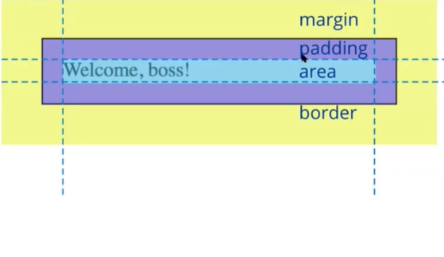

## Recap

Note:

- Promises

  ```js
  get("/api/addOne", {input: 5}}).then((six) => {
      return six + 1;
  }).then(((seven) => {
      console.log(seven);
  })).catch(error) => {
    // handle the error
  })
  ```

  

## Intro to Databases

 **What's wrong with data.txt?**

- Write Speed: Saves every story/comment whenever someone posts
- Memory Usage: Still keeps all stories/comments in RAM
- Query Speed: To find story with a particular _id, we linear search through all stories.
- Single Point of Failure: What if your laptop hard drive breaks?
- Concurrency Issues: What if two users post at the exact same time?

**What is a database?**

- Datebase (DB):

  data.txt but better

- DBMS:

  read/writeDateFromFIle() but better

We will use MongoDB as our database

We will run MongoDB in the cloud, using Atlas


## Workshop 6 - Database

Structure

- MongoDB Instance
  - Database
    - Collections
      - Documents (just like a javascript object)
        - Fields


**Mongoose**

NodeJS library that allows MongoDB integration

wrapper that allows you to interact with MongoDB API

**Schema**

- Schemas define the structure of  your documents
- Organization is key


**Mongoose Schemas: Processing Documents**

- Means of structuring MongoDB documents
  - Specify fields within a document
- Each collection should have a schema


**Mongoose Schema types**

String, Number, Date, Buffer, Boolean, Mixed, ObjectId, Array.

**Creating a Mongoose Model (Generally)**

1. Create a mongoose.Schema

   ```js
   const UserSchema = new mongoose.Schema({
       name: String, 
       age: Number, 
       pets: [String],
   })
   ```

 2. Create a mongoose.model

    ```js
    const User = mongoose.model("User", UserSchema)
    ```

    

**Creating Documents**

```js
const User = mongoose.model("User", UserSchema)

const Tim = new User({name: "Tim", age: 21, pets: ["cloudy"]});

Tim.save()
	.then((student) => console.log('Added ${student.name}'));
```


**All together**


**_id**

- Every document is automatically assigned a unique identifier
- The identifier is assigned under the "_id"  field.
- Useful when there's a relationship between documents

**Finding Documents**

```js
// return all
User.find({})
	.then((users) => console.log('Found ${users.length} users'));

User.find({name: "Tim"})

user.find({name: 'Tim', age: 21})
```

**Deleting Documents**

```js
// Deletes the first user in the collection named Tim
User.deleteOne({"name": "Tim"})
	.then((err) => {
    	if (err) return console.log("error");
    	console.log("Delete 1 user");
})

// Deletes all first user in the collection named Tim
User.deleteMany({"name": "Tim"})
	.then((err) => {
    	if (err) return console.log("error");
    	console.log("Delete all user");
})
```


**Mongoose Structure**


**Mongoose Parameters**

http://mongoosejs.com/docs/schematypes.html (from “All Schema Types”)

More advanced: http://mongoosejs.com/docs/validation.html 

More advanced: http://mongoosejs.com/docs/guide.html


## Workshop: Hook Database to Your Catbook App

### STEP 0: Create Comment and Story Mongoose Models

```js
const mongoose = require("mongoose")

// define story schema for the database
const StorySchema = new mongoose.Schema({
  creater_name: String,
  content: String
});

module.exports = mongoose.model("story", StorySchema);
```

```js
const mongoose = require("mongoose")

// define comment schema for the database
const CommentSchema = new mongoose.Schema({
  creater_name: String,
  parent: String,
  content: String
});

module.exports = mongoose.model("comment", CommentSchema);
```

### STEP 1 SETUP:

**Use api Route for Database Requests**

```js
// import models so we can interact with the database
const Story = require("./models/story")
const Comment = require("./model/comment")
```

```js
router.get("/stories", (req, res) => {
  Story.find({})
       .then( (stories) => {res.send(stories)} );
});

router.post("/story", (req, res) => {
  const newStory = new Story({
    creator_name: "jason",
    content: req.body.content,
  });

  newStory.save();
  
});
```


## Advanced CSS

### Palettes

how many theme colors?

2-3 colors

A website to select color: [coolors.co]()

### Box model



### Layouts

#### Display

display determines how elements size & sit with/in each other 

**display: block**

big blocks that stretch across, always sit on new lines generally useful, default property for div

(i.e. <div, <section, <ul, <p, <h1-6, <header)

**display: inline**

an element that is part of text, size is always proportional to text they do NOT accept width/height properties and top/bottom margins

(i.e, <span, <a, 

      ul > li { // selects all <li dirctly inside a <ul}

    - Descendant: ' '(space)

      div span {// selects all <span anywhere inside a <div} 

- CSS Pseudo-classes

  Used to specify a selector that is not direct represented in the HTML.

  ```css
  p::first-line { // first line of a <p>}
  ::selection { // user highlighted text }
  
  a::after {
      // styling placed in a generated element after every <a>
  }
  ```

  

  


