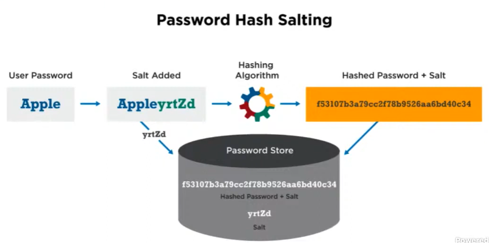
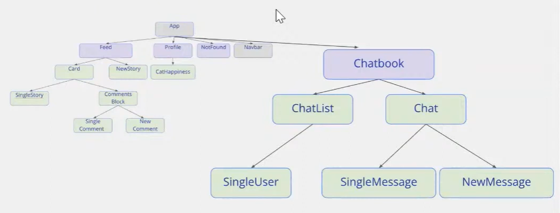
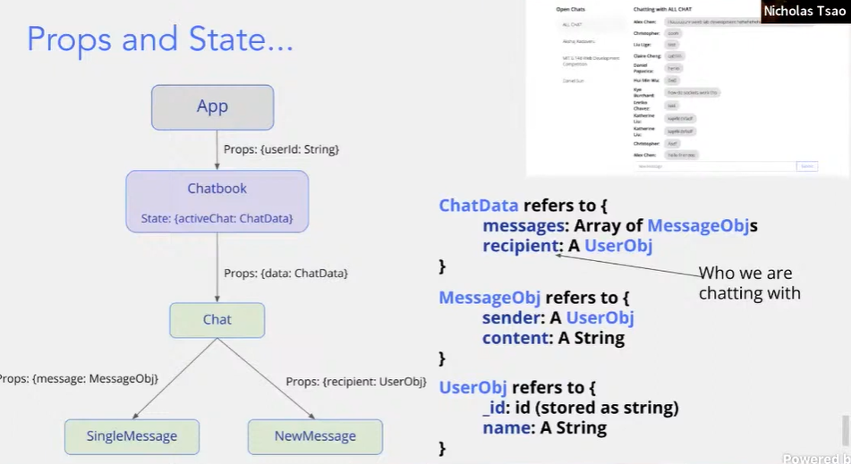

## Accounts & Authorization

Web applications need accounts 

Accounts need secure authentication

 

**session stored on server**

**json web tokens**

1. User submits login form 
2. server creates a JWT
3. Browser puts JWT in local storage
4. Signed JWT header validated on future requests


**Authentication nitty gritty**

How does password login work?

- we need to store info about each User in our database

Password Hash Salting



- How does the weblab skeleton store passwords securely>
- Our solution: let Google do it for us


## W8: Sockets

chatbook!





**Endpoint**

```js
// Get all of the messages
router.get("/chat", (req, res) => {
});

// Send a message to everyone
router.post("/message", (req, res) => {
});
```

### Step 1

In `Chatbook.js`

```js
const Chatbook = (props) => {
  /**
   * @typedef UserObject
   * @property {string} _id
   * @property {string} name
   */
  /**
   * @typedef MessageObject
   * @property {UserObject} sender
   * @property {string} content
   */
  /**
   * @typedef ChatData
   * @property {MessageObject[]} messages
   * @property {UserObject} recipient
   */

  // TODO (step 2.1): add state activeChat, an object with two fields:
  // recipient, and messages!
  // In this object, initialize recipient to ALL_CHAT, and messages to TEST_MESSAGES

  const loadMessageHistory = (recipient) => {
  };

  useEffect(() => {
    document.title = "Chatbook";
  }, []);

  // if (!props.userId) {
  //   return <div>Log in before using Chatbook</div>;
  // }

  return (
    <>
      <div className="u-flex u-relative Chatbook-container">
        <div className="Chatbook-chatContainer u-relative">
          {/* TODO (step 2.2): change data to use our activeChat state */}
          <Chat
            data={{
              recipient: ALL_CHAT,
              messages: TEST_MESSAGES,
            }}
          />
        </div>
      </div>
    </>
  );
}
```

In `chat.js`

```js
const Chat = (props) => {
  return (
    <div className="u-flexColumn Chat-container">
      <h3>Chatting with {props.data.recipient.name}</h3>
      <div className="Chat-historyContainer">
        {props.data.messages.map((m, i) => (
          <SingleMessage message={m} key={i} />
        ))}
      </div>
      <div className="Chat-newContainer">
        <NewMessage recipient={props.data.recipient} />
      </div>
    </div>
  );
}
```

in `SingleMessage`

```js
const SingleMessage = (props) => {
  return (
    <div className={"u-flex u-flex-alignCenter SingleMessage-container"}>
      <span className=" SingleMessage-sender u-bold">{props.message.sender.name + ":"}</span>
      <span className="SingleMessage-content">{props.message.content}</span>
    </div>
  );
}
```

in `NewMessage.js`

```js
const NewMessage = (props) => {
  // TODO (step 1.2): add sendMessage function and pass to onSubmit
  const sendMessage = (value) => {
    console.log(value);
  }
  

  // TODO (step 1.1): populate NewMessage
  return <NewPostInput defaultText="New message"/>;
}
```

## Step 2: Add the state activeChat to Chatbook

