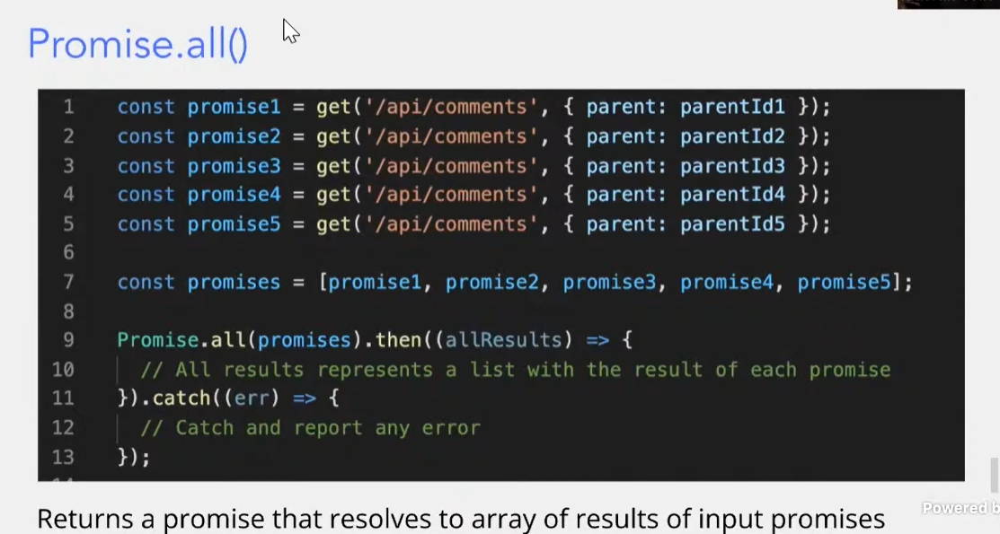
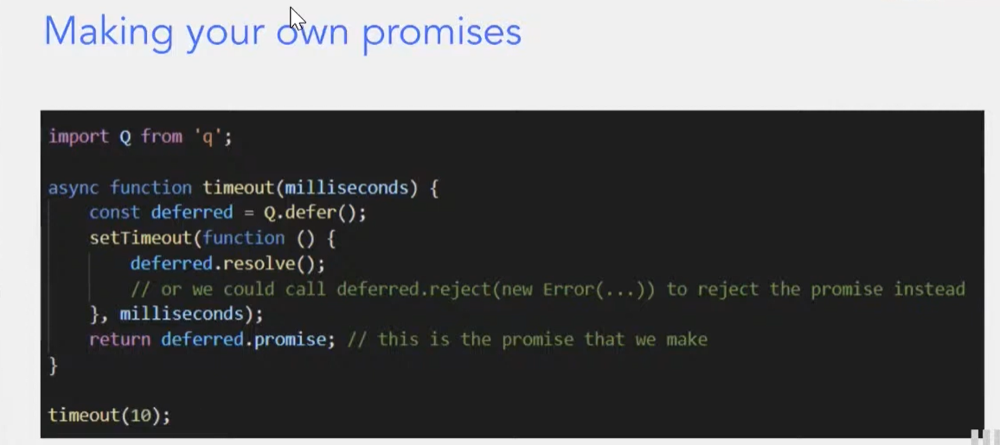

## Async Await

**Promises**

- A promise is an object in JavaScript 
- Represents some asynchronous task

Promises exist in three states

- Pending - initial state
- Fulfilled - the operation completed successfully
- Rejected - the operation failed

The asynchronous function immediately returns a promise. It "promises" to give you a snow cone later


**Handle promises with .then() and .catch()**

Once the promises is rejected, do stuff (call a callback function). Returns a promise.

.then() returns a promise, so we can do .then() again, and again. (same goes for .catch())


**Await** 

- You can't do computation with pending promises
- Wait for the promise to resolve
- Get the value that it resolves to 

```js
const a = slowNumber(9);
const b = slowNumber(10);

console.log(await a + await b);
```

can't work!


**Asynchronous functions**

- Functions that return control back to the caller before computation is done 
- Can be made as a callback function () => {}
- OR with the async keyword
  - Works with function, arrow functions, class methods, etc

```js
async function slowNumber(x) {
    sleep(1000);
    return x;
}
```

Only asynchronous functions can use await

```js
async function main() {
    const a = slowNubmer(9);
    const b = slowNubmer(10);
    
    console.log(await a + await b);
}
```

**Many promises**

   



